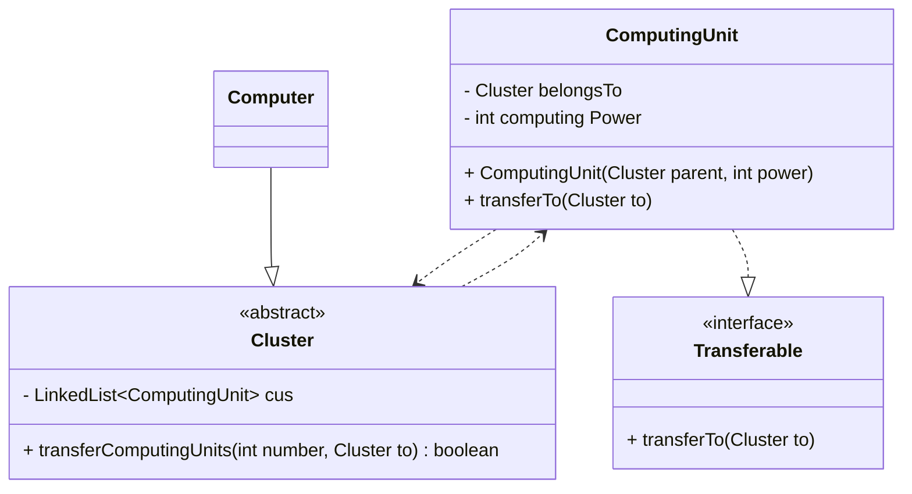

## Aufagbe 1
### a)
```java
public class ComputingUnit implements Transferable {
	private Cluster belongsTo;
	private final int computingPower;
	
	public ComputingUnit(Cluster parent, int power) {
		belongsTo = parent;
		computingPower = power;
	}

	 @Override
	 public void transferTo(Cluster to) {
		 // TODO Auto-generated method stub
	 }
 }

 public abstract class Cluster {
	 private final LinkedList<ComputingUnit> cus = new LinkedList<>();

	 public boolean transferComputingUnits(int number, Cluster to) {
		 // TODO Auto-generated method stub
		 return false;
	 }
 }

 public interface Transferable {
	 public void transferTo(Cluster to);
 }

 public class Computer extends Cluster {

 }
```


### b)
```java
public abstract class Cluster {
	private final LinkedList<ComputingUnit> cus = new LinkedList<>();
	
	public boolean transferComputingUnits(int number, Cluster to) {
		if(number > cus.size())
			return false;

		var units = cus.sublist(0, number);
	
		for(var unit : units)
			unit.transferTo(to)

		to.cus.addAll(units);
		
		units.clear();
		
		return true;
	}
}

public class ComputingUnit {
	private Cluster belongsTo;
	private final int computingPower;
	
	@Override
	public void transferTo(Cluster to) {
		belongsTo = to;
	}
}
```


### c)
```java
public class Computer extends Cluster {
	private Computer s_Instance;

	private Computer() { }

	public static synchronized Computer get() {
		if(s_Instance == null) {
			s_Instance = new Computer();
		}

		return s_Instance;
	}
}
```

### d)
```java
var computer = new Computer();
System.out.println(computer.transferComputingUnits(100, new Cluster()));
```
Geht ned weil Cluster abstract ist und nicht erzeugt werden kann

```java
Computer computer = new Computer();
Cluster cluster = new Computer();
var cu = new ComputingUnit(computer, 100);
```
Richtig, Computer extends Cluster

```java
ComputingUnit cu = new ComputingUnit();
var computer = new Computer();
cu.transferTo(computer);
```
Geht ned, weil ComputingUnit braucht 2 parameter im konstruktor

### d)

